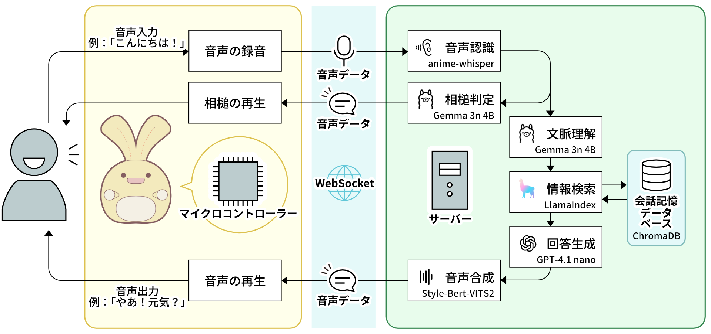
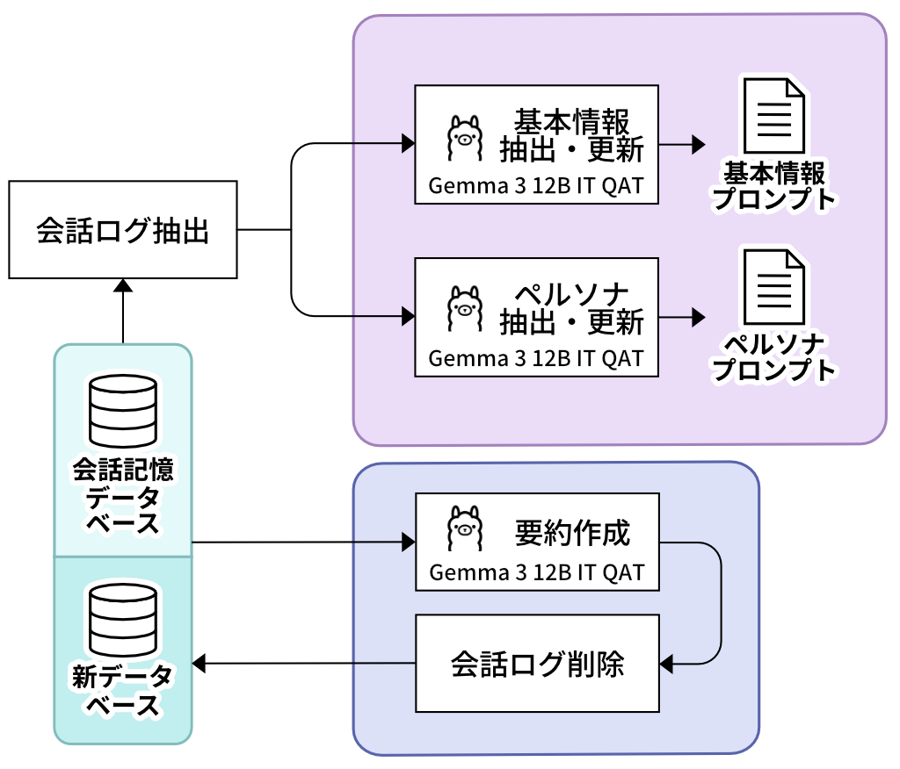
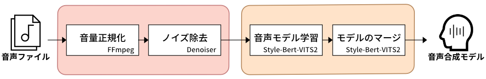
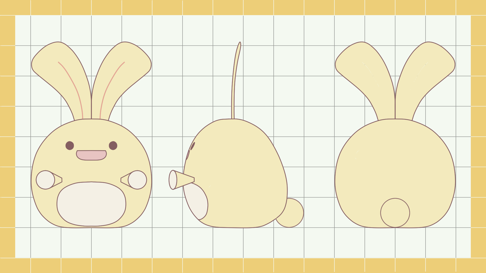
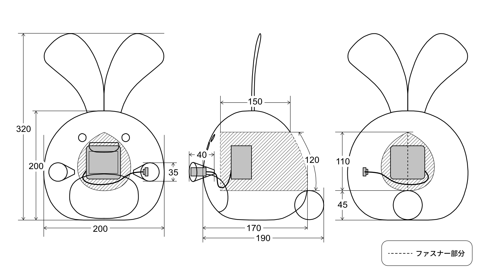

# 日常会話を通じてユーザーを模倣するAIぬいぐるみシステム

卒業研究にて開発した、ユーザーの声や話し方、性格を段階的に学習・模倣するAIぬいぐるみシステムです。
クラウド上の大規模言語モデル (LLM) とローカルの軽量LLMを連携させたハイブリッド構成により、自然な会話のテンポ（応答遅延の低減）と適切な文脈理解の両立を目指しました。

## 🎥 デモ動画
(ここに動画リンク)

※セッションを経るごとに、ぬいぐるみの個性がユーザーのものに似ていく様子が確認できます。

## ⚙️ システム構成 (Architecture)

フロントエンド（エッジデバイス）にはM5Stack CoreS3を内蔵したぬいぐるみを、バックエンドには非同期処理 (FastAPI/WebSocket) を用いたサーバーを使用しています。

### ハイブリッドLLM会話システム
会話の没入感を削がないため、以下の2段階プロセスで応答を制御しています。
1. **即時応答（ローカル）**:
ユーザーの発話をOllama (Gemma 3n 4B)で即座に意図分類し、サーバー上に保持された相槌音声を先行してエッジ側へ送信・再生します。
2. **メイン応答（クラウド・ローカル）**:
相槌を再生している裏で、LlamaIndexを用いたRAG（ChromaDB）により過去の会話履歴を検索します。

抽出したユーザーのペルソナ情報を元に、メインのLLM (GPT-4.1-nano) で応答を生成し、Style-Bert-VITS2で音声合成を行います。

## 🧠 学習・更新プロセス (Learning & Voice Processing)
日々の会話ログからユーザーの特徴を抽出し、システムに反映させる学習処理の構成です。

- **基本情報・ペルソナ抽出**: Gemma 3 12Bを用いて会話ログから情報を抽出し、プロンプトを更新。

- **音声学習とマージ**: 録音データからノイズを除去し、Style-Bert-VITS2で追加学習。
既存モデルとマージすることで、段階的かつなめらかな声色の変化を実現しています。

## 🐰 プロダクトデザイン (Hardware Design)
愛着の湧くコミュニケーションUXを実現するため、ハードウェアの形状・手触りから内部構造まで独自に設計・制作しました。

| 外観デザインコンセプト | 内部ハードウェア設計・寸法 |
| :---: | :---: |
|  |  |

## 📂 主要なディレクトリ・ファイル構成

- `client/src/main.cpp`: エッジ側 (M5Stack CoreS3) の制御プログラム。
- `server/main.py`: バックエンド側のメインゲートウェイ。FastAPIとWebSocketを用いた双方向通信。
- `server/rag.py`: LlamaIndexおよびChromaDBを用いた記憶管理。
- `server/update_persona.py`: 蓄積された会話ログからユーザーの「Big-Fiveスコア」等を抽出し、指数移動平均 (EMA) を用いてペルソナプロンプトを更新。

## 🛠 使用技術
- **ハードウェア**: M5Stack CoreS3 (C++ / Arduino)
- **バックエンド**: Python, FastAPI, WebSockets
- **AI/LLM**: OpenAI API, Ollama (ローカル LLM), LlamaIndex
- **Speech**: Whisper (STT), Style-Bert-VITS2 (TTS)